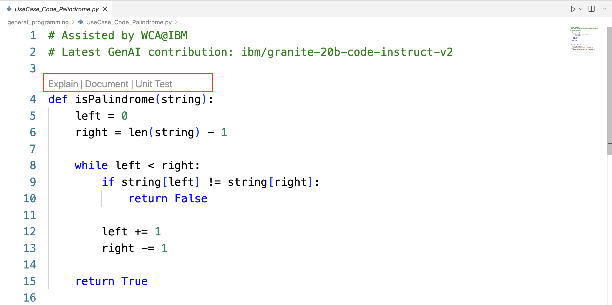
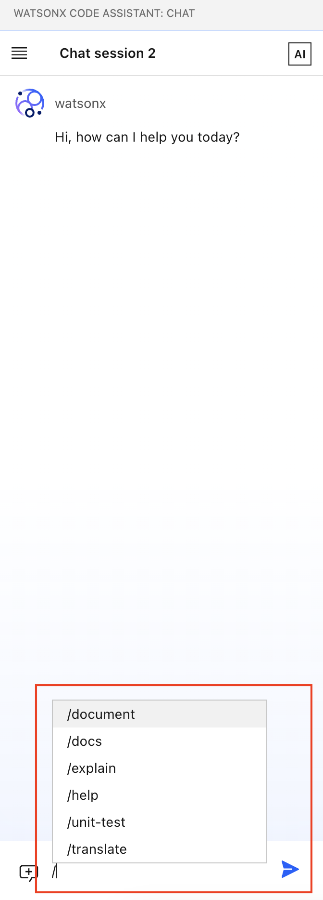
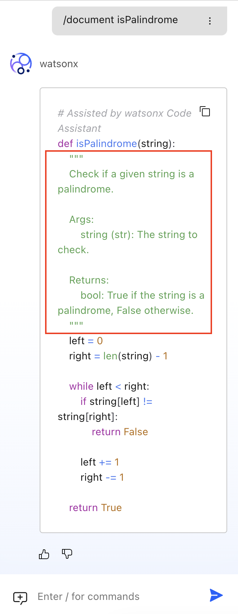
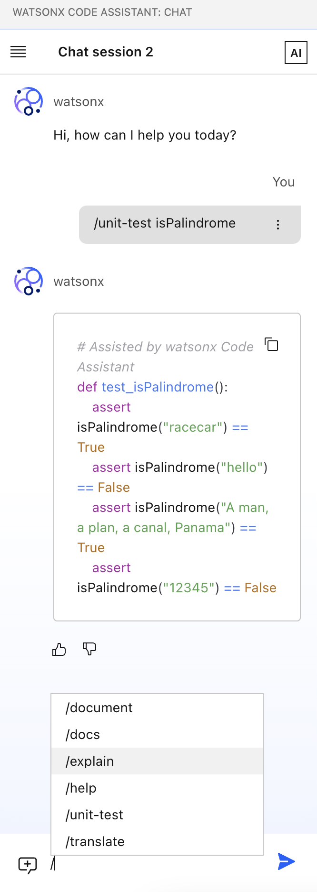

# General Programming

이 문서는 General Programming lab을 완료하기 위한 단계별 가이드를 제공합니다. 하지만 몇 가지 자신만의 시도를 추가해 보세요.

## General Programming covers:

- JAVA외의 다른 언어를 이용한 General programming은 다음을 포함 합니다.
    - code auto completion
    - code explanation
    - code documentation
    - unit test generation
    - code translation

General programming을 지원하는 방법이 크게 두 가지가 있습니다.
하나는 인라인 함수나 클래스에서 해당 기능에 대한 옵션을 확인 하는 것이고
다른 하나는 챗 윈도우에서 커맨드를 이용하여 사용하는 방법입니다.

아래 예제는 인라인 함수에서의 일반 프로그래밍을 지원하는 옵션을 보여주고 있습니다.



다음은 챗 윈도우에서 확인할 수 있는 챗 커맨드 이고 챗 윈도우에서 보다 많은 옵션을 확인할 수 있습니다.




### 1. Code Auto Completion

개발자가 코드를 작성할 때, wCA는 실시간으로 인라인 제안을 제공합니다.


### 2. Code Explanation

wCA는 코드 샘플에 정의된 세부 사항과 함수를 설명하는 데 도움을 줄 수 있습니다.
이를 위해 함수 위의 설명 옵션을 클릭하면 됩니다.
또는, 채팅에 다음을 입력하여 전체 파일을 설명할 수 있습니다:

```
/explain @UseCase_Code_Palindrome.py
```

### 3. Code Documentation

wCA는 주어진 코드 샘플에 대한 document string을 생성하는 데 도움을 줄 수 있습니다.



### 4. Unit test generation

Java와 마찬가지로, 단위 테스트 생성은 다른 언어에서도 가능합니다.



### 5. Code Translation

코드 변환은 다음 syntex를 통해 제공 됩니다:

```
/translate from SOURCE_LANGUAGE to TARGET_LANGUAGE @REFERENCE_FILE|CODE_SNIPPET
```


SOURCE_LANGUAGE는 선택적으로 사용 가능하고 번역 시 생략할 수 있습니다.

아래 예제에서는 Python palindrom 코드를 Go 언어로 변환할 것입니다. 다음 프롬프트를 시도해 보세요:

```
/translate from python to go UseCase_Code_Palindrome.py
```


