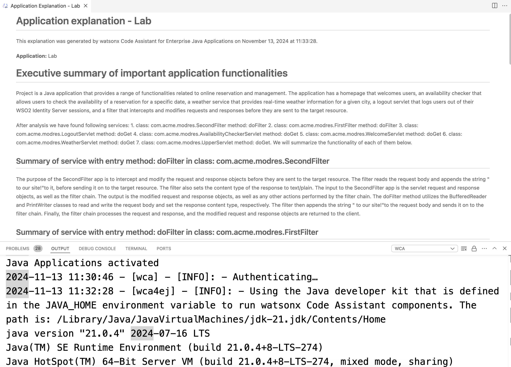

# Application Explanation Lab

이 문서는 Application Explanation 을 완료하기 위한 단계별 가이드를 제공합니다.

## Application Explanation Lab covers:

- `modresrots` 애플리케이션에 대한 설명 받기


### 1. Check moderesorts application

- 터미널에서 Lab-2-wca-4-enterprise-java 아래 `moderesorts-twas-j8` 폴더로 이동해 주세요.


### 2. Build Application Project

- moderesorts-twas-j8 폴더 아래 `was_dependency` 를 찾아 가 주세요.


```bash
cd <your-path>/wca4ej-workshop/modresorts-twas-j8/was_dependency
```
- 해당 폴더에서 다음 커맨드를 이용하여 프로젝트를 빌드 해 주세요.

```bash
mvn install:install-file -Dfile=was_public.jar -DpomFile=was_public-9.0.0.pom
```


윈도우 사용자는 `was_public.jar` 와 `was_public-9.0.0.pom` 파일에 전체 경로를 주어야 합니다.


### 3. View Liberty App

VSCode extention marketplace로 부터 LibertyTools를 설치 한 후에, Liberty Dashobard가 있는 것을 확인 해 주세요. `Add project to Liberty Dashboard`를 클릭한 다음  `modresort-twas-j8` 폴더를 dashoboard에 추가해 주세요.


프로젝트를 선택한 후, `modresrots` 앱이 나타나면 앱을 마우스 오른쪽 버튼으로 클릭하여 시작하세요.


터미널을 보면 VSCode가 필요한 패키지를 다운로드하는 과정을 확인할 수 있습니다.


앱이 시작되면 URL(`http://localhost:9080/resorts/`)을 확인할 수 있고,  이 URL을 브라우저에서 열어 앱을 확인할 수 있습니다.

**[IMPORTANT]** `moderesort` 애플리케이션을 Liberty에서 Java21을 사용하여 실행하고 있으며, 해당 애플리케이션은 WebSphere에서 Java8로 빌드되었기 때문에, 애플리케이션이 성공적으로 시작되었더라도 이 **마이그레이션 + 업그레이드로 인해 2군데에서 오류가 발생합니다**.


첫 번째로,  `Where to?` 드롭다운을 선택하고  어떤 위치를 선택하면 위치 정보 모듈에서 오류가 발생하는 것을 확인할 수 있습니다.


두 번째, `Logout` 을 클릭하면 에러가 발생하고 동작하지 않습니다.


해당 에러는 다른 랩을 통해  **나중에 수정 할 예정입니다.**


### 4. Explain Application

전체 프로젝트를 이해하기 위해서,  `modresorts-twas-j8` 폴더에서 오른쪽 버튼을 누르고 `watsonx Code Assistant` - `Explain Application`을 선택해 주세요.


VSCode 에서 애플리케이션을 분석하는데 기능이 시간이 걸림을 안내해 줍니다. `Proceed with code analysis` 선택 해 주세요.


분석에는 1-2분 정도 소요될 수 있으며, 완료되면 오른쪽 하단에 프롬프트가 표시됩니다.


이제 보고서를 열고 세부 사항을 읽어볼 수 있습니다.

