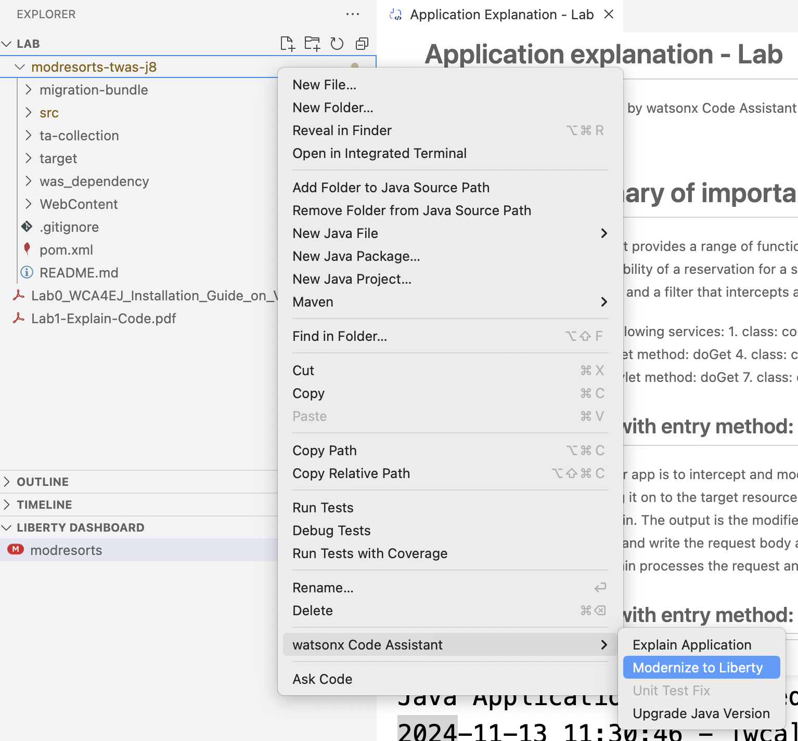
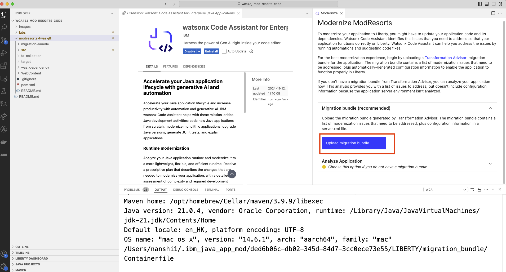
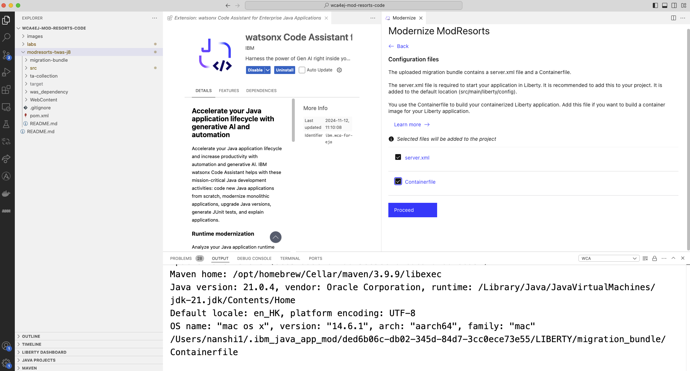
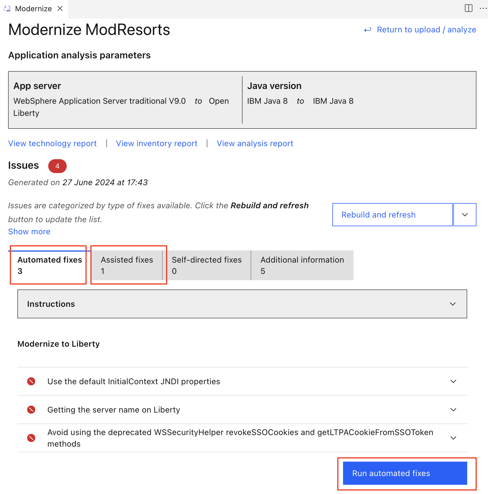
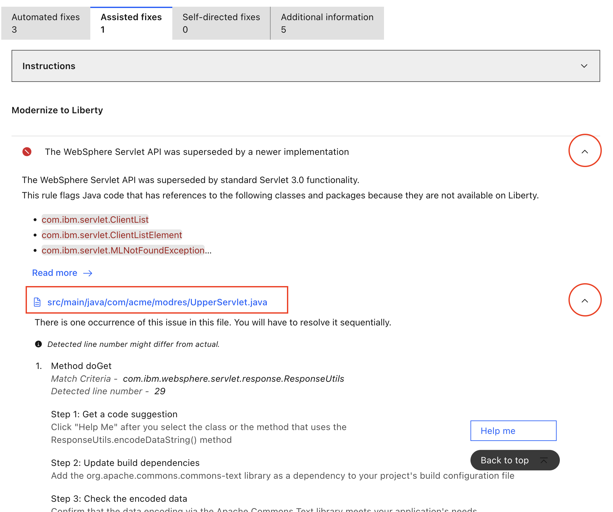
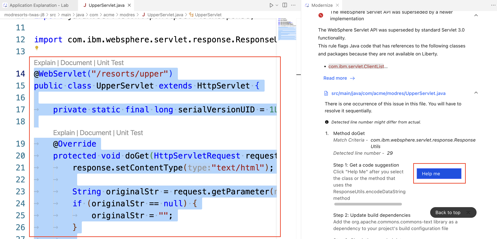
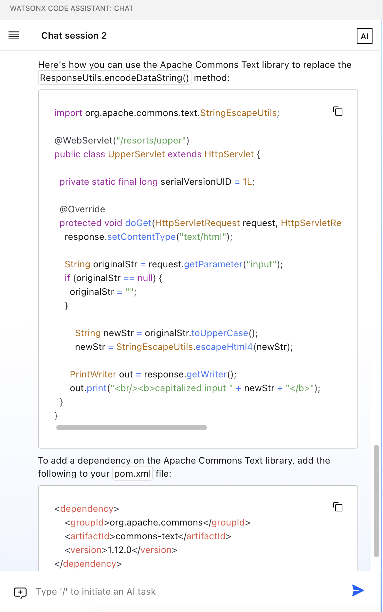
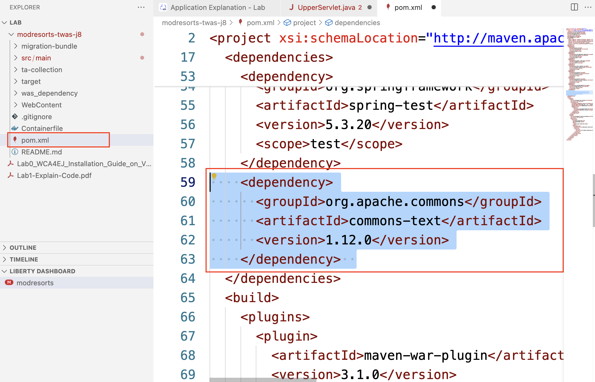
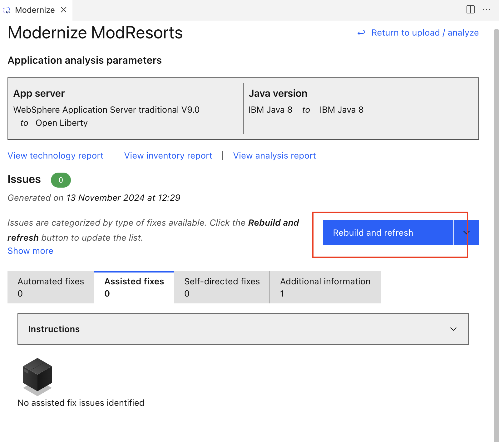
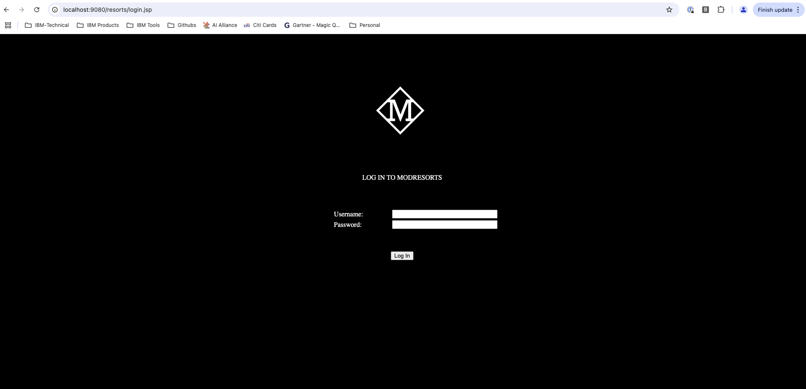

# Runtime Modernization

이 문서는 런타임 현대화를 완료하기 위한 단계별 가이드를 제공합니다.

## Runtime Modernization covers:

- WebSphere 에서 Liberty로의 런타임 현대화

### 1. Application analysis

`modresorts-twas-j8` 폴더에서 마우스 오른쪽 버튼을 클릭 한 후, `watsonx Code Assistant` - `Modernize to Liberty` 를 선택해 주세요.

`Modernize` 탭이 에디터 창에 나타납니다. `Upload migration bundle`을 클릭하고 다음 경로에서 `modresorts-twas-j8/migration-bundle/modresorts.ear_migrationBundle.zip` 번들을 선택해 주세요.

Liberty로 변환하기 위해 일단 서버 구성에 필요한 configuration파일이 필요 합니다. wCA에서는 자동으로 해당 파일을 추가할 수 있습니다.
화면에서 보이는 두개의 파일을 선택하고 `Proceed`를 클릭 해 주세요.

분석 후 보고서는 이 애플리케이션에서 수정해야 할 문제를 보여줍니다. 그 중 3개는 자동으로 수정할 수 있고, 1개는 도움이 필요합니다. 자동 수정을 위해서는, `Run automated fixes`을 클릭합니다..

### 2. Apply Fixes

수동 수정을 위해서는 `Instructions` 드롭다운을 클릭하여 단계별 안내를 확인할 수 있습니다. 이제 문제의 드롭다운을 확장합니다. 문제를 해결하는 방법에 대한 명확한 지침이 아래에 제공됩니다.

이제 문제가 있는 파일 이름을 클릭합니다. 편집기 창에서 `ResponseUtils.encodeDataString()` 메서드를 사용하는 클래스 전체를 선택합니다. 그런 다음 Help me를 클릭하여 wCA의 도움을 요청합니다.

채팅창에 wCA가 앞의 문제점을 바탕으로 수정 방법에 대해 질의 한 것을 확인할 수 있으며, 이후 이슈를 해결할 수 있는 방법에 대한 제안을 답변으로 받습니다.

여기에는 2가지 작업 항목이 있습니다.
- 첫 번째로 `UpperServlet.java` 파일의 코드를 채팅에서 복사한 코드로 변경해야 합니다.
- 두 번째로 `pom.xml` 파일에 dependency를 추가 하여 업데이트 합니다.

### 3. Rebuild Application

이제 모든 수정 사항을 적용했습니다. `modresort` 애플리케이션이 여전히 실행 중이라면, `TERMINAL` 로 이동하여 `CTRL+C`를 눌러 중지하세요. `Rebuild and refresh`를 통해 애플리케이션에 더 이상 문제가 없는지 확인할 수 있습니다.

브라우저로 이동하여 새로운 애플리케이션을 확인할 수 있습니다. 이번에는 `Logout` 버튼이 수정된 것을 확인할 수 있습니다.
