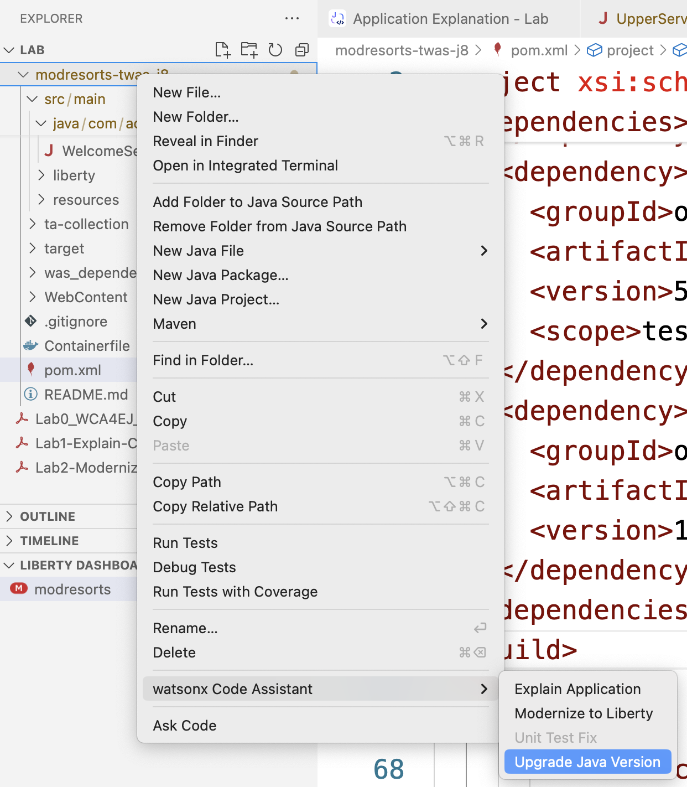
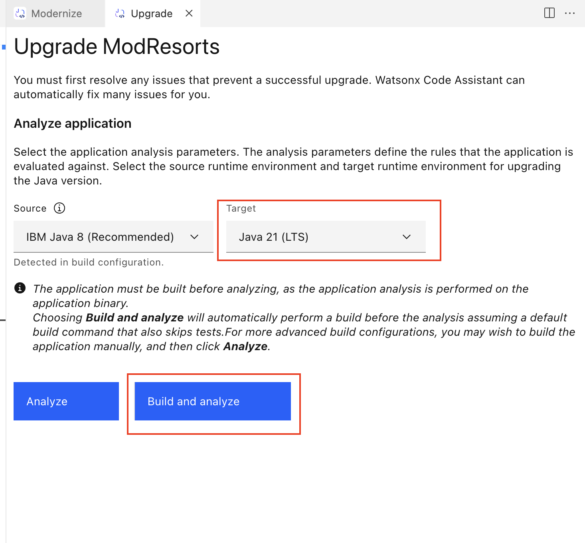
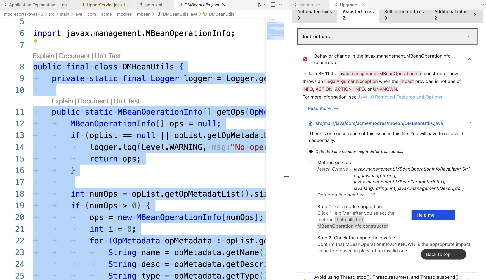
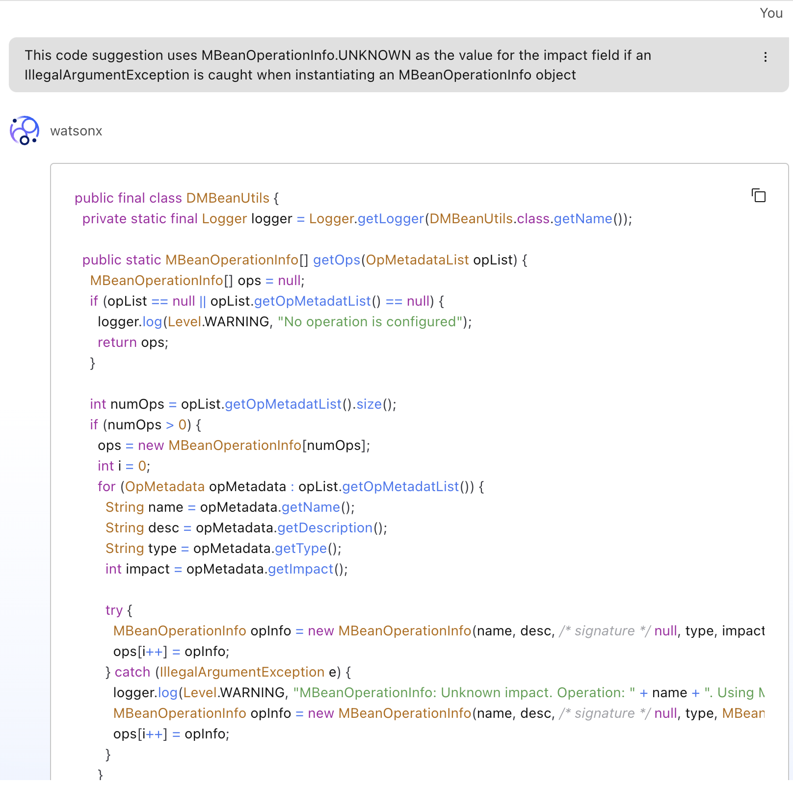

# Upgrade Java Version

이 문서는 Upgrade Java version Lab 완료하기 위한 단계별 가이드를 제공합니다. Modernize 랩과 매우 유사한 단계를 확인 할 수 있을 것입니다.

## Upgrade Java Version covers:

- Java 버전을 8에서 21로 업그레이드 합니다.

### 1. Application analysis

`modresorts-twas-j8` 폴더에서 오른쪽 마우스를 클릭 하고  `watsonx Code Assistant` - `Upgrade Java Version`을 선택 해 주세요.

`Upgrade` 탭이 나타나게 됩니다. `Target` 드롭다운을 확장하고 난 후, `Java 21 (LTS)`을 선택 . 해주세요. `Build and analyze` 를 클릭합니다..

분석 후 보고서에는  `modresorts` 애플리케이션에서 수정해야 할 문제를 보여줍니다. 그 중 3개는 자동으로 수정할 수 있고, 2개는 도움이 필요합니다. 자동 수정을 위해서는 `Run automated fixes`을 클릭합니다(이 과정은 오래 걸릴 수 있습니다).

### 2. Apply Fixes

수동 수정을 위해서는 `Instructions`  드롭다운을 클릭하여 단계별 안내를 확인할 수 있습니다. 이제 첫 번째 문제의 드롭다운을 확장합니다. 문제를 해결하는 방법에 대한 명확한 지침이 아래에 제공됩니다.

이제 문제가 있는 파일 이름을 클릭합니다. 편집기 창에서`MBeanOperationInfo` 생성자를 호출하는 클래스 전체를 선택합니다. 그런 다음 Help me를 클릭하여 wCA의 도움을 요청합니다.

채팅창에 wCA가 앞의 문제점을 바탕으로 수정 방법에 대해 질의 한 것을 확인할 수 있으며, 이후 이슈를 해결할 수 있는 방법에 대한 제안을 답변으로 받습니다.

여기서는 채팅에서 복사한 코드를 사용하여 `DMbeanUtils.java` 파일의 코드를 변경합니다.

일단 두 번째 문제는 deprecation 경고이므로 무시할 수 있습니다. 또는 재빌드 시 오류가 발생하면 동일한 과정을 거쳐 경고를 수정할 수 있습니다."

### 3. Rebuild Application

이제 모든 수정 사항을 적용했으므로, `Rebuild and refresh`를 통해 애플리케이션에 더 이상 중요한 문제가 없는지 확인할 수 있습니다.

브라우저로 이동하여 새로운 애플리케이션을 확인할 수 있습니다. 이번에는 위치 모듈이 수정된 것을 확인할 수 있습니다.

