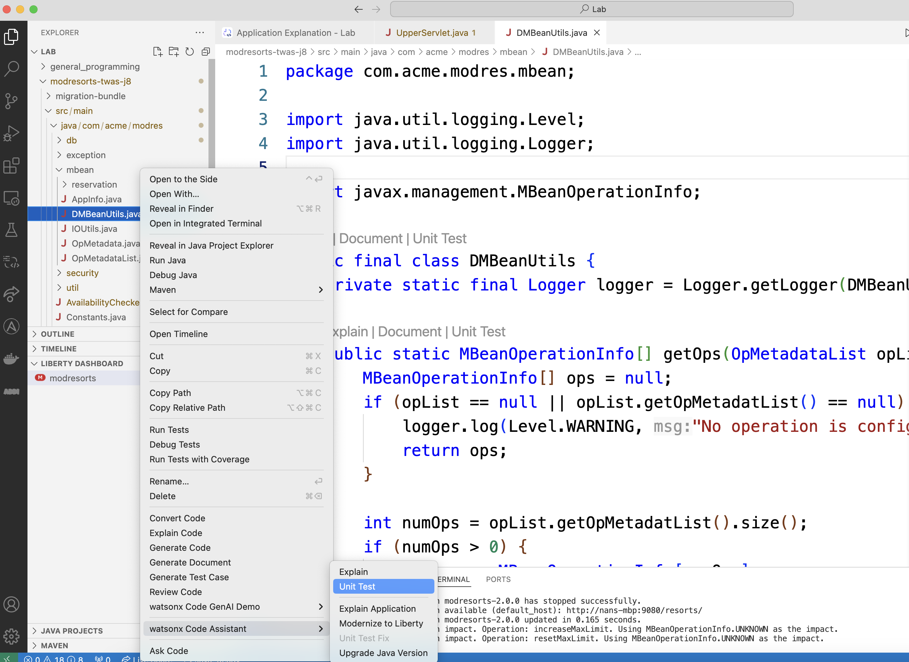

# Unit Test Generation

이 문서는 Unit Test Generation lab을 완료하기 위한 단계별 가이드를 제공합니다.

## Unit Test Generation Lab covers:

- 유닛 테스트 생성하기

### 1. Generate unit test for a given script

프로젝트의 java 파일 들 중 하나를 선택하여 오른쪽 마우스를 클릭한 후 "Unit Test"를 선택하여 해당 파일의 유닛 테스트를 생성 해 주세요. 여기 예제는  `moderesort` 애플리케이션의 `DMBeanUtils.java`를 이용하였습니다.

채팅 세션에 생성된 테스트 케이스가 다시 표시됩니다.

