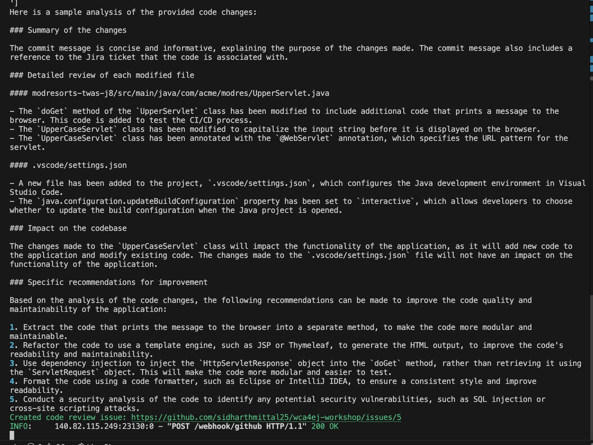
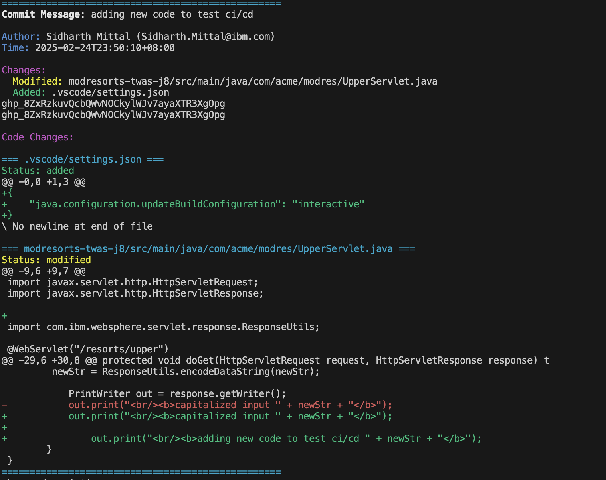

# Lab 2: CI/CD 리뷰 트리거하기

이 문서는 Lab 2를 완료하기 위한 단계별 가이드를 제공합니다. Lab 2에서는 git commit과 git push를 생성하여 자동으로 git webhook이 push 내용을 리뷰하도록 트리거하는 작업을 수행합니다.

## Lab 2 content:

### 1. smee 클라이언트 시작하기 (한 터미널에서):
   ```bash
   smee -u <your-smee-url> -t http://localhost:8000/webhook/github
   ```

### 2. webhook 서버 시작하기 (다른 터미널에서):
   ```bash
   python main.py
   ```

서버는 다음과 같은 기능을 수행합니다:
- http://localhost:8000에서 실행됩니다
- 코드 변경 시 자동으로 재로드됩니다
- smee.io를 통해 webhook을 수신합니다
- 실시간으로 커밋 정보를 표시합니다
- 구문 강조와 함께 코드 변경사항을 보여줍니다
- 상세한 코드 리뷰 이슈를 생성합니다

### 3.  테스트를 위해, git webhook을 구성한 저장소에 git commit을 생성하고 push하세요. 출력은 다음과 같이 나타날 것입니다:



